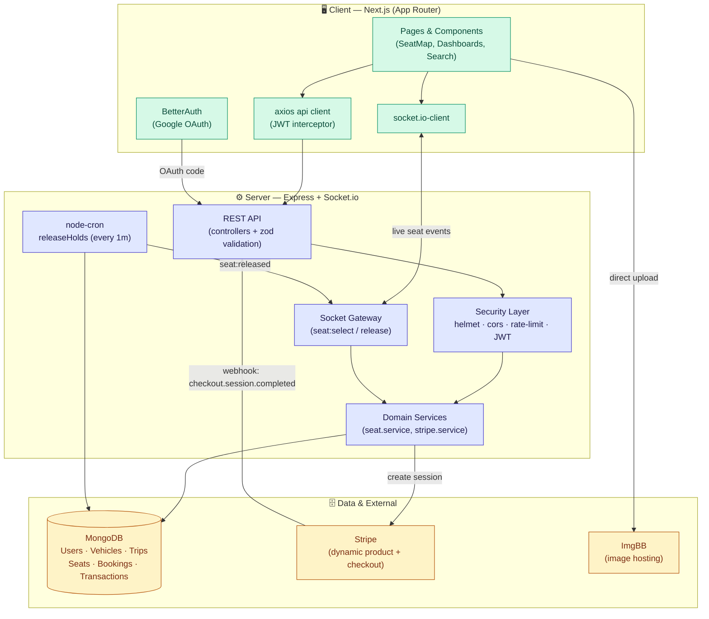
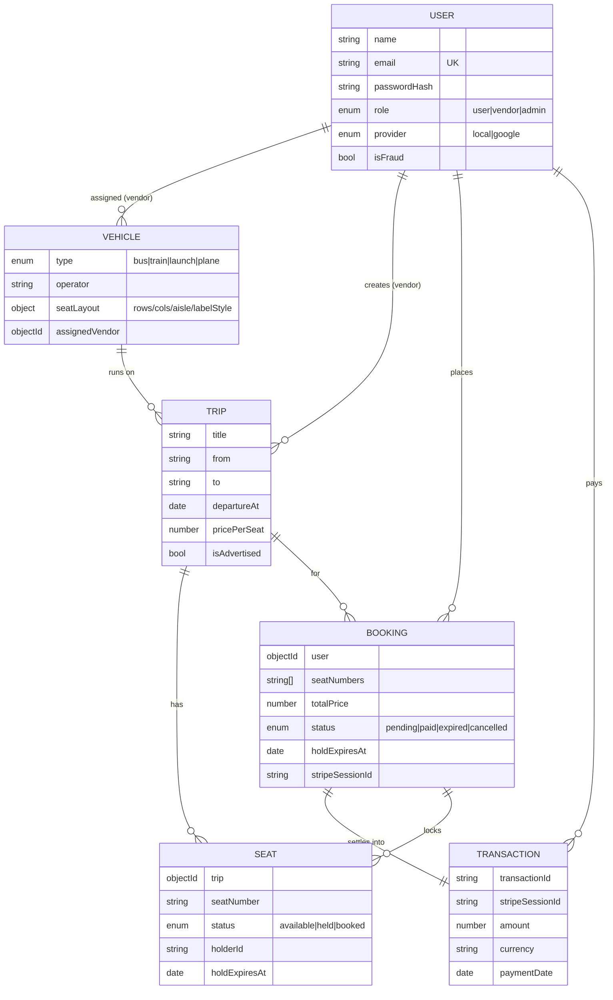
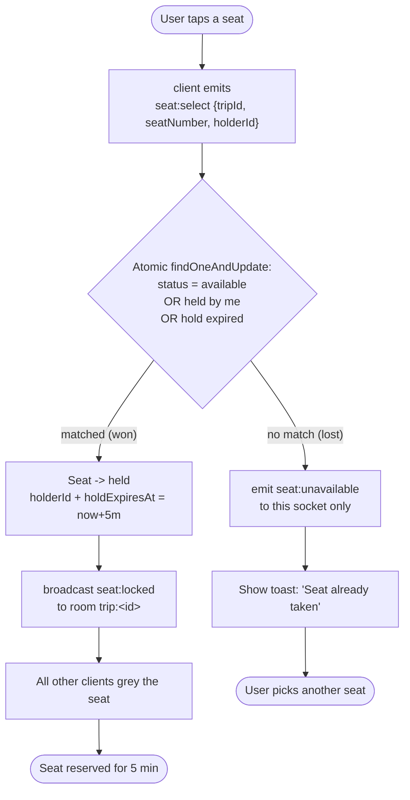
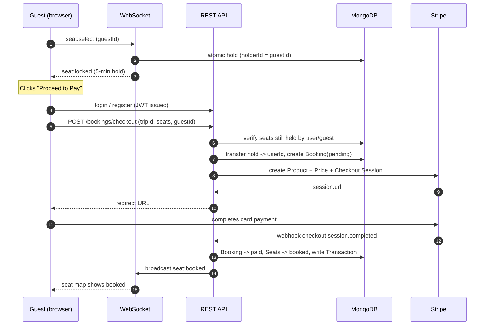
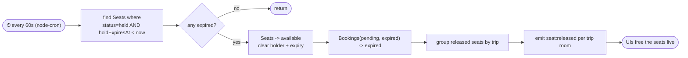
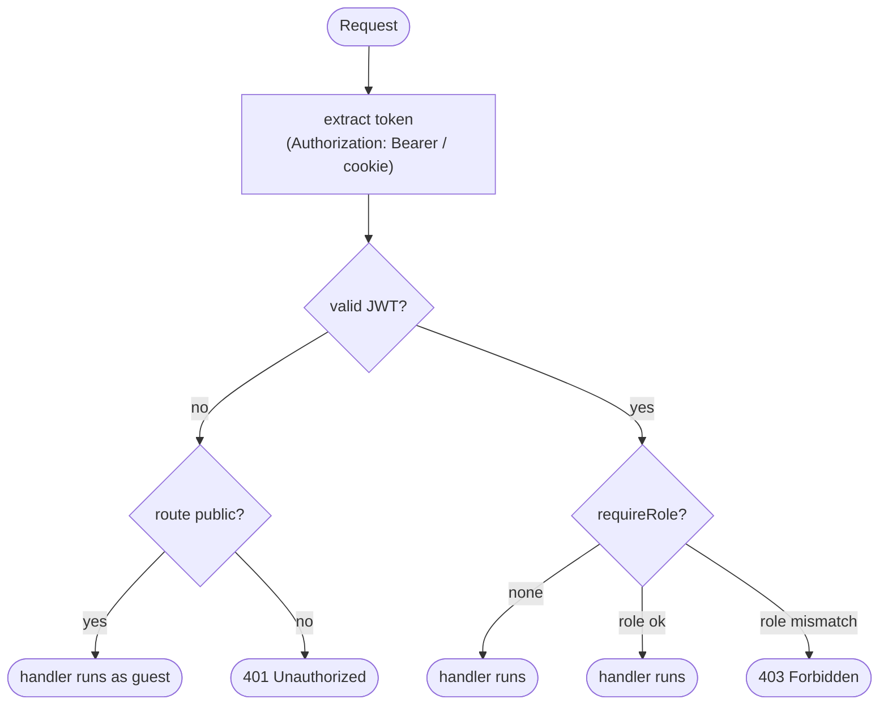
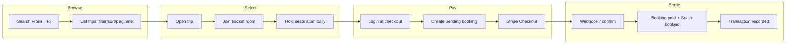

  
  <h1>Jatri — System Architecture & Engineering Notes</h1>
  
<em>Real-time, multi-modal travel ticketing for Bangladesh.</em>

---

## 1. Overview

**Jatri** (যাত্রী — _"passenger"_) is a full-stack platform for booking **bus, train, launch, and plane**
tickets across Bangladesh. Its defining characteristic is a **live, conflict-free seat-selection
engine**: many users (and even unauthenticated guests) can browse the same trip simultaneously, and the
seat map updates in real time so two people can never pay for the same seat.

The system is split into two deployables:

| Tier | Stack | Responsibility |
|------|-------|----------------|
| **Client** (`client/`) | Next.js 15 (App Router), React 19, TypeScript, Tailwind | UI, dashboards, real-time seat map, checkout redirect |
| **Server** (`server/`) | Node + Express, TypeScript, MongoDB/Mongoose, Socket.io | REST API, WebSocket seat locking, cron hold release, Stripe |

---

## 2. High-Level System Architecture

### Why two channels (REST **and** WebSocket)?

- **REST** handles request/response work: auth, CRUD for trips/vehicles, creating a checkout, fetching bookings.
- **WebSocket** handles the *broadcast* problem: when one person holds a seat, **everyone watching that trip**
  must see it instantly. Polling would be wasteful and laggy, so Jatri rooms each trip
  (`trip:<id>`) and pushes `seat:locked` / `seat:released` / `seat:booked` events only to interested clients.

---

## 3. Data Model (ER Diagram)

**Key index design** — the seat collection carries a **compound unique index** `{ trip, seatNumber }`
(one physical seat per trip) plus secondary indexes on `status` and `holdExpiresAt` so both the
real-time hold query and the cron sweep stay fast.

---

## 4. Activity Diagram — Real-time Seat Hold (the core)

The hold is performed with a **single atomic `findOneAndUpdate`**. The query condition itself encodes
the business rule, so concurrent requests can never both succeed — the database, not the application,
is the arbiter.

> The matching condition `available OR (held by me) OR (hold expired)` is what makes the operation
> **idempotent and self-healing**: re-selecting your own seat refreshes the hold, and a stale hold from a
> user who left is automatically reclaimable without any cleanup step.

---

## 5. Activity Diagram — Guest → Booking → Payment

Login is deferred until the **payment step**, lowering friction during browsing and seat selection.

If the user abandons checkout, no webhook fires — the **cron job** below reclaims the seat.

---

## 6. Activity Diagram — Cron Hold-Release (anti-deadlock)

This guarantees the system can never **deadlock on inventory**: a seat held by someone who closed their
tab is guaranteed to return to the pool within ~1 minute, and every watching client is told immediately.

---

## 7. Roles & Authorization Flow

| Role | Can do |
|------|--------|
| **User** | Browse, hold seats, book & pay, view own bookings/transactions, cancel pending |
| **Vendor** | Everything a user can + create/manage trips on **assigned** vehicles, view revenue |
| **Admin** | Manage users, create/assign vehicles to vendors, advertise trips, flag fraud |

Two auth strategies coexist: **email/password** issues a custom JWT (`jsonwebtoken` + `bcrypt`), while
**Google** sign-in is brokered by BetterAuth on the client and exchanged for the same app JWT — so the
rest of the API is auth-mechanism agnostic.

---

## 8. Request/Realtime Lifecycle Summary

See the root [`README.md`](../README.md) for the full feature list and engineering techniques, and
[`server/README.md`](../server/README.md) / [`client/README.md`](../client/README.md) for tier-specific
setup and API references.
